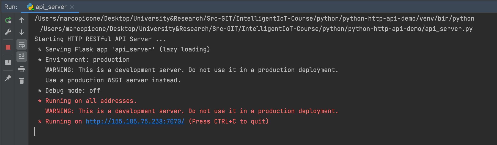
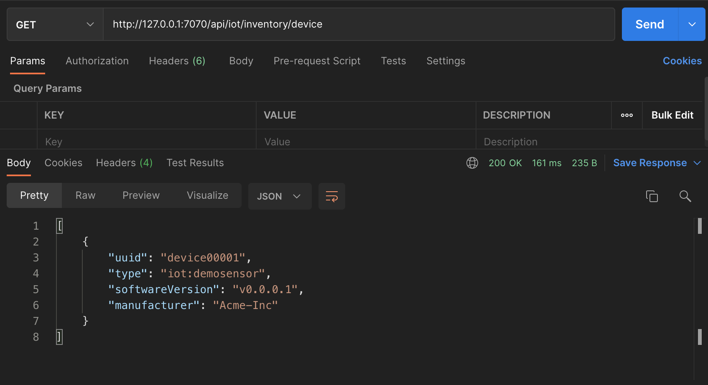
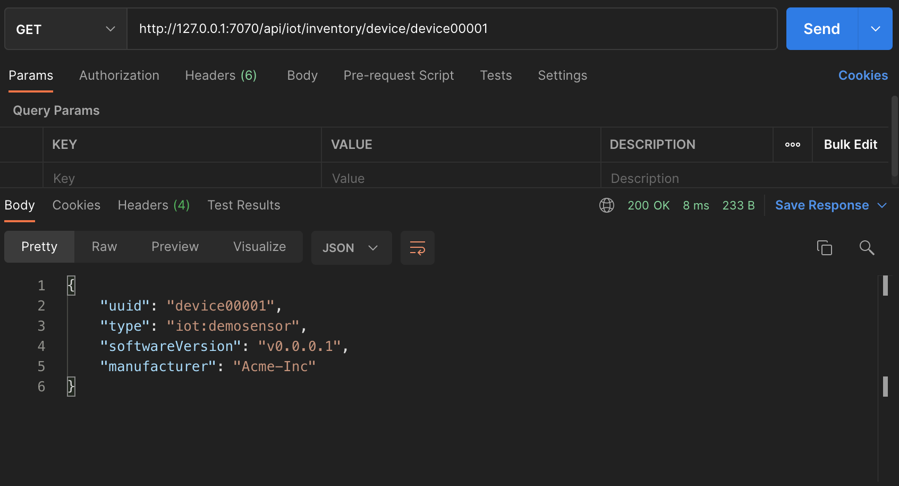
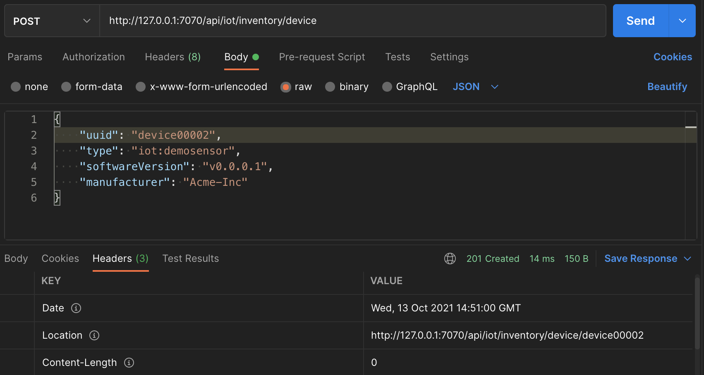

# Python - Laboratory RESTful HTTP API

This project in associated to the HTTP RESTful API Laboratory and it is used to show how to implement
a REST API through the use of the Python programming language and the following dependencies:

- Flask: https://flask.palletsprojects.com/en/2.0.x/
- Flask RESTful: https://flask-restful.readthedocs.io/en/latest/index.html

APIs are exposed through a configurable port (7070) and accessible locally at: http://127.0.0.1:7070/api/iot/

In order to have additional information have a look at the official laboratory documentation and the step-by-step tutorial

Laboratory structure and main sections are:

- [API HTTP RESTful Specifications](#api-http-restful-specifications)
- [Project Creation & Dependencies](#project-creation--dependencies)
- [Model Classes](#model-classes)
- [Device Data Manager](#device-data-manager)
- [Creation of the Devices Resource](#creation-of-the-devices-resource)
- [HTTP Service Creation](#http-service-creation)
- [Creation of the Device Resource](#creation-of-the-device-resource)
- [Creating a New Device (HTTP - POST)](#creating-a-new-device-http---post)
- [Implementation of PUT and DELETE](#implementation-of-put-and-delete)

## API HTTP RESTful Specifications

In the following subsections, the specifications of the HTTP RESTful API to be implemented are provided. 
The base PATH to be used for the API is `api/iot/inventory`. 

An example of a complete URL associated with the PATH and the demo resource to be modeled (device) is: http://127.0.0.1:7070/api/iot/inventory/device.

### Device Data Structure

The data structure to be created for our IoT Device model should include the following fields:

- uuid (String): Unique identifier of the device. This ID will also be used as the key to identify it within the REST resources.
- type (String): Identifies the device type. Any value is allowed (e.g., temperature, humidity, demo sensor).
- softwareVersion (String): Represents the version of the software running on the device.
- manufacturer (String): Identifies the manufacturer of the device.

- An example JSON representation of the resource to be modeled is as follows:

```json
{
    "uuid": "device00002",
    "type": "iot:demosensor",
    "softwareVersion": "v0.0.0.1",
    "manufacturer": "Acme-Inc"
}
```

### Endpoint HTTP RESTful to Design and Implement

For the device resource, the following endpoints are considered, 
along with their characteristics in terms of HTTP methods, body, headers, and response codes:

- **(READ DEVICE LIST) HTTP GET /device**: Returns the list of all devices registered on the server.
- Request Body: Empty
- Response:
  - Header: Content-Type: application/json
  - Body: [{…}, {…}, {Device Data Structure}]
  - Response Codes:
    - 200 OK
    - 400 Bad Request
    - 404 Not Found
    - 500 Internal Server Error

- **(CREATE NEW DEVICE) HTTP POST /device**: Create a new device.
- Request Body: {Device Data Structure}
- Response:
  - Header: Location: http://127.0.0.1:7070/api/iot/inventory/device/device00001
  - Body: Empty
  - Response Codes:
    - 201 Created
    - 400 Bad Request
    - 409 Conflict
    - 500 Internal Server Error

- **(READ DEVICE) HTTP GET /device/<device_id>**: Read the target device through its ID.
- Request Body: Empty
- Response:
  - Header: Content-Type: application/json
  - Body: {Device Data Structure}
  - Response Codes:
    - 200 OK
    - 400 Bad Request
    - 404 Not Found
    - 500 Internal Server Error

- **(UPDATE DEVICE) HTTP PUT /device/<device_id>**: Update a target device through its ID.
- Request Body: {Device Data Structure}
- Response:
  - Body: Empty
  - Response Codes:
    - 204 No Content
    - 400 Bad Request
    - 404 Not Found
    - 500 Internal Server Error

- **(REMOVE DEVICE) HTTP DELETE /device/<device_id>**: Delete the target device through its ID.
- Request Body: Empty
- Response:
  - Body: Empty
  - Response Codes:
    - 204 No Content
    - 400 Bad Request
    - 404 Not Found
    - 500 Internal Server Error

## Project Creation & Dependencies

Create a new Python project by importing the following dependencies:

- flask (Package Flask): Web and Web Framework
- flask_restful (Package Flask-RESTful): Flask Plugin to build RESTful APIs

## Model Classes

Create a folder named `model`. 
Inside it, create the file `device_model.py` and the following class `DeviceModel`, 
which will represent the description of our IoT object model with the following fields:

- `uuid`: To uniquely identify the object.
- `type`: To specify the device type.
- `softwareVersion`: For the version of software running on the device.
- `manufacturer`: To identify the device manufacturer.

The created class should follow the approach explained in class, 
comprising the following components: i) Constructor for initializing all class attributes, and ii) toJson method for simplified serialization handling. The class example is provided in the following listing:

```python
import json

class DeviceModel:

    def __init__(self, uuid, type, softwareVersion, manufacturer):
        self.uuid = uuid
        self.softwareVersion = softwareVersion
        self.manufacturer = manufacturer
        self.type = type
        
    def to_json(self):
        return json.dumps(self, default=lambda o: o.__dict__)
```

## Device Data Manager

Create a new folder named `persistence` 
which will contain the class for data storage (in this example, using a dictionary for in-memory storage). 
Within the persistence package, create the file `data_manager.py` with the following `DataManager` 
class responsible for handling all storage operations (read, create, and update) for 
the project's devices using the previously created DeviceModel class:

```python
from model.device_model import DeviceModel

class DataManager:

    device_dictionary = {}

    def add_device(self, newDevice):
        if isinstance(newDevice, DeviceModel):
            self.device_dictionary[newDevice.uuid] = newDevice
        else:
            raise TypeError("Error adding new device! Only DeviceModel are allowed!")

    def update_device(self, updatedDevice):
        if isinstance(updatedDevice, DeviceModel):
            self.device_dictionary[updatedDevice.uuid] = updatedDevice
        else:
            raise TypeError("Error updating the device! Only DeviceModel are allowed!")

    def remove_device(self, deviceUUID):
        if deviceUUID in self.device_dictionary.keys():
            del self.device_dictionary[deviceUUID]
```

The methods within `DataManager` allow for creating, modifying, 
and removing devices from the map and thus from the storage system. 
Specifically, note that the `add_device()` and `update_device()` 
methods validate the type of the parameter passed. In the case of an invalid type different from `DeviceModel`, 
they raise a system exception of type TypeError to signal to the calling method the error with the provided parameter.

## Creation of the Devices Resource

Create a new folder named resources that will contain the dedicated Python classes for describing the RESTful 
resources managed by the HTTP service. The Flask framework handles resources and their sub-elements differently. 
For this reason, it will be necessary to create separate classes for each type of resource. 
For example, to handle requests on `/device` and `/device/<device_id>`.

Firstly, let's begin with creating the class to handle requests on `/device` and enable the retrieval of the list of devices (GET) 
and their creation (POST).

Create a file named `devices_resource.py` containing the `DevicesResource` class with the following initial structure:

```python
from json import JSONDecodeError
from flask import request, Response
from flask_restful import Resource, reqparse
from model.device_model import DeviceModel

class DevicesResource(Resource):

    def __init__(self, **kwargs):
        self.dataManager = kwargs['data_manager']

    def get(self):
        device_list = []
        for device in self.dataManager.device_dictionary.values():
            device_list.append(device.__dict__)
        return device_list, 200
```

The newly created class extends the Flask class Resource and has the following characteristics:

- The constructor allows retrieving variables passed during instantiation through a dictionary. In this specific case, we retrieve the data_manager variable of type DataManager, which will be stored as an attribute of the class to maintain a reference for working with the stored data. The passing of DataManager to the class will be explained in the next step.
- The Flask framework, through the base class Resource, enables quick association of HTTP methods (GET, POST, PUT, DELETE) with Python functions named the same way (get, post, put, delete). In the current case, for instance, we can handle GET requests by redefining the method using the syntax: def get(self):. As illustrated later, these methods can also have parameters associated with the path and are usable within the function.

## HTTP Service Creation

Create a new file in the main project directory named `api_service.py` that will contain the definition of the HTTP server and its 
REST resources to be managed. The following listing presents the structure of the class:

```python
from flask import Flask
from flask_restful import Resource, Api, reqparse
from resources.devices_resource import DevicesResource
from persistence.data_manager import DataManager
from model.device_model import DeviceModel

app = Flask(__name__)
api = Api(app)

ENDPOINT_PREFIX = "/api/iot/inventory"

print("Starting HTTP RESTful API Server ...")

dataManager = DataManager()

demoDevice = DeviceModel("device00001", "iot:demosensor", "v0.0.0.1", "Acme-Inc")

dataManager.add_device(demoDevice)

api.add_resource(DevicesResource, ENDPOINT_PREFIX + '/device',
                 resource_class_kwargs={'data_manager': dataManager},
                 endpoint="devices",
                 methods=['GET', 'POST'])

if __name__ == '__main__':
    app.run(host='0.0.0.0', port=7070, debug=True)
```

In the provided code, the following aspects are highlighted:

- Imports necessary classes and references.
- Creates a Flask server and an API through FlaskRestful using the statements `app = Flask(__name__)}` and `api = Api(app)`. These variables will be used to configure the REST resources to use and the server's operating parameters (e.g., IP and port).
- Creates a `DataManager` variable to manage data storage. This variable will then be passed to resource classes for precise handling of data read and write functionalities.
- Creates a demo `DeviceModel` object to immediately insert into the `DataModel` for testing purposes. 
- Adds a new resource of the type `DevicesResource`, previously created and associated with the endpoint `/api/iot/inventory/device`, using the `api.add_resource` method. Additionally, it passes the `DataManager` reference to the resource through `resource_class_kwargs`, specifies an endpoint name, and defines the supported methods (Flask will automatically respond with a 405 Method Not Allowed for all other methods).
- Specifies the port to launch the service (`7070`) and on which IPs and interfaces to bind (all, specifying `0.0.0.0`).

With the code defined above, you can launch the server and test the GET request to retrieve the list of registered devices using Postman. Once the service is launched, check the output in the console as shown in the following Figure \ref{fig:run_log}.



Subsequently, test the service using the Postman HTTP REST client with the following parameters:

- Method: GET 
- URL: http://127.0.0.1:7070/api/iot/inventory/device

The results on Postman are illustrated in Figure 



## Creation of the Device Resource

Create a file named `device_resource.py` containing the `DeviceResource` 
class to manage access to the resource associated with a single device, rather than a list of devices. 
The structure of the class is as follows:

```python
from json import JSONDecodeError
from flask import request, Response
from flask_restful import Resource


class DeviceResource(Resource):

    def __init__(self, **kwargs):
        self.dataManager = kwargs['data_manager']

    def get(self, device_id):
        if device_id in self.dataManager.device_dictionary:
            return self.dataManager.device_dictionary[device_id].__dict__, 200
        else:
            return {'error': "Device Not Found !"}, 404
```

The newly created class still extends the Flask class `Resource` 
but aims to handle requests arriving on paths of the form `/device/<device_id>`. 
The class possesses the following characteristics:

- The constructor allows retrieving variables passed during instantiation through a dictionary. 
In this specific case, we retrieve the `data_manager` variable of type `DataManager`, 
which will be stored as an attribute of the class to maintain a reference for working with the stored data.
- Definition of the method `def get(self, device_id):` to handle GET requests on the resource. 
In this case, there's an additional parameter that will be correctly passed by the Flask framework and will 
contain the value of the deviceId passed in the path. For example, the value could be `device00001` with a URL structure like `http://127.0.0.1:7070/api/iot/inventory/device/device00001`

In order to test the service, it's necessary to first add the new resource and its management to the previously created 
`api_service.py` file. The code to be inserted consists of the correct reference 
import (`from resources.device_resource import DeviceResource`) and then the following method call:

```python
api.add_resource(DeviceResource, ENDPOINT_PREFIX + '/device/<string:device_id>',
                 resource_class_kwargs={'data_manager': dataManager},
                 endpoint='device',
                 methods=['GET', 'PUT', 'DELETE'])
```

The newly integrated code allows adding the new resource to the server and associating it with requests that match the specified 
path `/device/string:device_id`. 
The format `string:device_id` not only specifies the variable's key to use `device_id`, 
but also its type (in this case, `string` or, for example, `int`). 
As explained earlier, Flask will pass the value of the path parameter to the 
`get` method of the previously created `DeviceResource` class. 

Subsequently, test the service using the Postman HTTP REST client with the following parameters:

- Method: GET 
- URL: http://127.0.0.1:7070/api/iot/inventory/device/device00001

The results on Postman are illustrated in the following figure:



## Creating a New Device (HTTP - POST)

In order to create a new device on the newly created server, it's necessary to handle the POST 
method in the `DevicesResource` class to respond appropriately to `POST` requests on the path `/device`. 
Specifically, add the following method to the `DevicesResource` class:

```python
def post(self):
  try:
    json_data = request.get_json(force=True)
    deviceModel = DeviceModel(**json_data)
    if deviceModel.uuid in self.data_manager.device_dictionary:
      return {'error': "Device UUID already exists"}, 409
    else:
      self.data_manager.add_device(deviceModel)
      return Response(status=201, headers={"Location": request.url + "/" + deviceModel.uuid})
  except JSONDecodeError:
    return {'error': "Invalid JSON ! Check the request"}, 400
  except Exception as e:
    return {'error': "Generic Internal Server Error ! Reason: " + str(e)}, 500
```

Specifically, the created code enables the following operations:


- Deserializes the received JSON body using the method `request.get_json(force=True)`, where the 
`request` variable is available due to the extension of the Flask framework's Resource class. 
The use of the parameter `force=True` enforces deserialization even if the Content-Type specified 
by the client is not `application/json`. While the client should ideally always specify the correct type, 
forcing deserialization can help mitigate minor client errors.
- Transforms the deserialized generic JSON object into the `DeviceModel` class using 
the syntax `deviceModel = DeviceModel(**json\_data)`.
- Checks if a device with the same `UUID` already exists in the `DataManager`. 
If so, it responds with an error message and a response code of `409 CONFLICT`.
- If the device is new, it adds it to the `DataManager` and responds with a 
`201` response code and the `Location` header containing the URL to the new resource. 
In this case, the response uses the `Response` class to specify an empty body, 
which wouldn't be possible using the compact form `return <object>, <response_code>`.
So we use: `Response(status=201, headers={"Location": request.url+"/"+deviceModel.uuid})`

Use Postman to make a POST request with the following characteristics:

- Method: POST
- Body Type: RAW
- Format: JSON
- Body: As shown in the following listing and in Figure

```json
{
    "uuid": "device00002",
    "type": "iot:demosensor",
    "softwareVersion": "v0.0.0.1",
    "manufacturer": "Acme-Inc"
}
```



Note in the Postman response how the response code is 201, there's no body present, 
and among the headers, the Location header contains the URL to which the client can 
make a new GET request to retrieve the representation of the created resource. 
Perform a test with a GET request to verify the proper functioning.

## Implementation of PUT and DELETE

As additional exercises, implement and add the following methods to the `DeviceResource` class:

- `def update(...)` to be associated with the HTTP `PUT` method for updating an existing resource, 
performing appropriate checks on the request, resource ID, and body. In case of success, 
the response code should be `204` with no body, while in case of error, use 404 for a resource not found or `500` in case of a server error. 
In both error cases, specify a message in the body explaining the problem details.
- `def delete(...)` to be associated with the HTTP `DELETE` method for deleting a resource by its ID. 
In this case, it's necessary to validate and check the presence of the requested resource and respond with 
`204` with no body in case of success, `404` for a resource not found, or `500` in case of a server error. 
In both error cases, specify a message in the body explaining the problem details.

Below are the method declarations with the correct `FlaskRESTful` annotations to be used. 
The student should fill in and complete these methods correctly to define their proper REST behavior.

```python
def put(self, device_id):
    ... [TO BE COMPLETED] ...
```

```python
def delete(self, device_id):
    ... [TO BE COMPLETED] ...
```